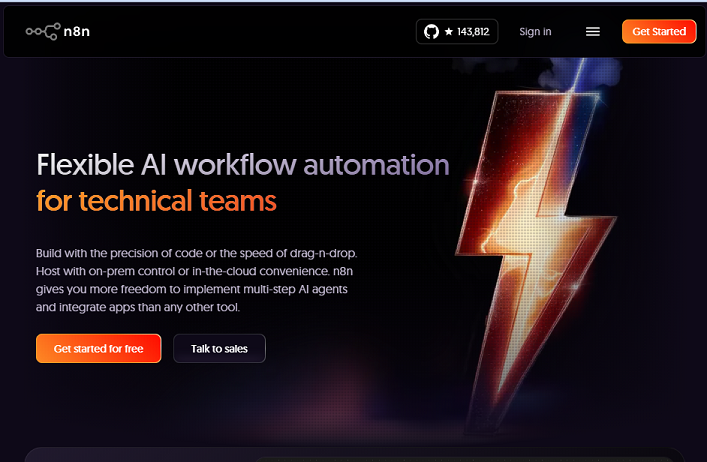
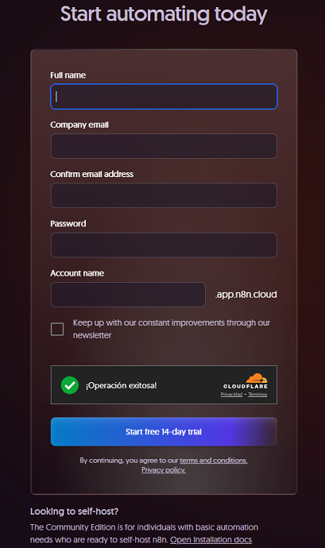
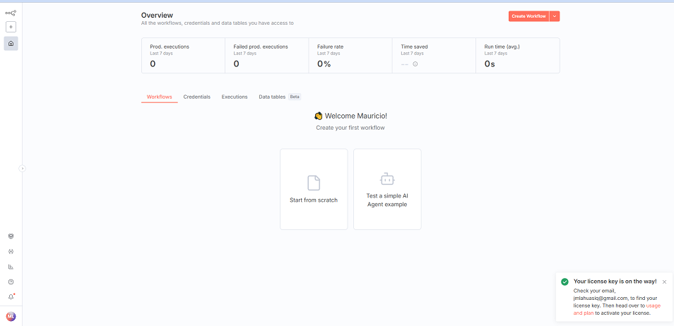
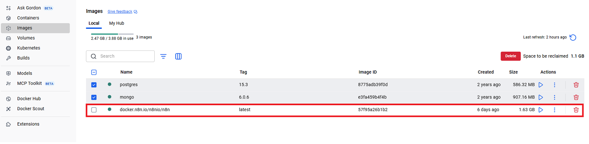
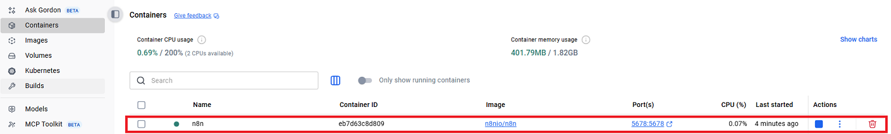

# n8n

## 🚀 ¿Qué es n8n?

n8n significa **"nodemation"** (_Node Automation_).  
Es una **plataforma open-source de automatización de flujos de trabajo** (_workflow automation_) que combina lo mejor del mundo **low-code/no-code** con la flexibilidad de extender funcionalidades usando código.

---

### ✨ Características principales

- 🔗 **Conexión de APIs, BBDD y SaaS** con más de **350 integraciones listas para usar**.
- 🖥️ **Flexible en su despliegue**: funciona en la nube o **self-hosted** en tu propia infraestructura.
- 🎨 **Editor visual de workflows** con sistema _drag & drop_.
- ⏱️ Ejecución **basada en eventos, webhooks o programada**.
- 🧑‍💻 Extensible con **JavaScript** para crear nodos personalizados.
- 🔒 **Privacidad y control total de datos** al poder auto-hospedarse.
- 🌍 **Comunidad activa** y en crecimiento constante.

---

### 🏗️ Arquitectura simplificada

Los **workflows** en n8n están formados por **nodos**:

- 📥 **Nodos de entrada**: reciben datos (por ejemplo, un email entrante).
- ⚙️ **Nodos de transformación**: procesan los datos (ejemplo: convertir texto a JSON).
- 📤 **Nodos de salida**: envían datos a otro servicio (ejemplo: publicar en Twitter o guardar en una base de datos).

Cada nodo puede ser configurado visualmente y encadenado con otros para formar un **pipeline de automatización**.

---

### 🌟 ¿Por qué es tan popular?

- ✅ Código abierto y gratuito para empezar.
- 🔄 Flexibilidad y escalabilidad.
- 🧩 Extensible con nodos personalizados.
- 👥 Gran comunidad que comparte flujos y plantillas.

---

### 📊 Comparativa con otras herramientas

| Característica        | n8n          | Zapier ❌ | Make (Integromat) ❌ |
| --------------------- | ------------ | --------- | -------------------- |
| Código abierto        | ✅           | ❌        | ❌                   |
| Self-hosting          | ✅           | ❌        | ❌                   |
| Nodos personalizables | ✅           | ❌        | Limitado             |
| Límite de tareas      | Ilimitado    | Limitado  | Limitado             |
| Precio                | Desde gratis | 💲        | 💲                   |

---

### 💡 Casos de uso

- **Marketing** → Publicar en redes sociales desde Google Sheets.
- **Atención al cliente** → Crear tickets en un CRM al recibir un email.
- **Educación** → Procesar respuestas de formularios automáticamente.
- **Desarrollo** → Ejecutar funciones, Webhooks y APIs, integrando microservicios y automatizando procesos de backend.

---

### 📥 Recursos adicionales

- 🌐 Más de **4500 plantillas listas para usar**: [n8n.io/workflows](https://n8n.io/workflows/)
- 📖 Documentación oficial: [docs.n8n.io](https://docs.n8n.io)
- 🧑‍🤝‍🧑 Comunidad: [community.n8n.io](https://community.n8n.io)

---

### 🏢 Beneficios para empresas y equipos

- ⏳ Ahorro de tiempo en tareas repetitivas.
- 🛡️ Menos errores humanos en procesos críticos.
- ⚡ Integración rápida con sistemas ya existentes.
- 🤝 Mejora en productividad y colaboración.
- 💰 Reducción de costos frente a soluciones SaaS cerradas como Zapier.

---

### ✅ Buenas prácticas recomendadas

1. 📂 Versionar workflows en repositorios Git para mantener historial.
2. 🔑 Usar variables de entorno para credenciales y endpoints.
3. 🧪 Probar workflows en entornos de staging antes de producción.
4. 📊 Monitorizar ejecuciones y configurar alertas.
5. 🔄 Reutilizar nodos y plantillas para mantener consistencia.

---

### 🔍 ¿Cuándo elegir n8n?

Elige n8n si:

- Necesitas **control total de los datos** (self-hosting).
- Buscas una solución **más económica** que Zapier o Make.
- Requieres **extensibilidad** con código personalizado.
- Quieres aprovechar la **comunidad open-source** y sus plantillas.

No es ideal si:

- 🚫 Prefieres no administrar infraestructura propia.
- 🚫 Solo necesitas flujos simples y no buscas extensibilidad.

---

## 🤔 ¿Qué puedo hacer con n8n?

n8n permite automatizar tareas de todo tipo, desde las más simples hasta flujos complejos que integran múltiples aplicaciones. Algunos ejemplos:

### 📧 Productividad y comunicación

- Organizar automáticamente la **bandeja de entrada** de un correo electrónico (clasificando entre críticos, urgentes o irrelevantes).
- Enviar recordatorios o notificaciones personalizadas según reglas definidas.
- Gestionar citas en Google Calendar a partir de un **chat o conversación previa**.

### 🗄️ Datos y bases de datos

- Usar un **agente de IA** para realizar actualizaciones controladas en una base de datos.
- Integrar APIs y almacenar resultados en **Google Sheets, Postgres, MongoDB**, entre otros.
- Ejecutar consultas y generar reportes de forma periódica.

### 📊 Reportes y métricas

- Cada semana, recopilar información estadística, calcular métricas, generar un reporte en Google Sheets y enviarlo automáticamente por correo.

### 👩‍💼 Procesos de negocio

- Automatizar series de pasos en **flujos de documentación de clientes** (validación, almacenamiento y notificación).
- Integrar con CRMs para crear tickets, actualizar registros o dar seguimiento a leads.

### 🎥 Marketing y contenido digital

- Crear **videos automatizados sin rostro**, añadir audio y generar miniaturas atractivas para redes sociales.
- Publicar contenido en redes sociales directamente desde un Google Sheet o CMS.

---

👉 En resumen, con n8n puedes pasar de tareas manuales repetitivas a **flujos inteligentes y automatizados**, que ahorran tiempo y reducen errores humanos.

---

## 🆕 Crear una cuenta en n8n y usar la prueba gratuita

Para comenzar a usar n8n en la nube puedes registrarte fácilmente en su plataforma oficial:

### 🔹 Pasos para registrarse

1. Accede a la página oficial 👉 [n8n.io](https://n8n.io/).
2. Haz clic en **Sign up / Get Started for Free**.
3. Completa el formulario de registro con:
   - **Nombre y correo electrónico**.
   - **Contraseña segura**.
4. Confirma tu correo electrónico desde el enlace que recibirás.
5. Una vez validado, podrás acceder al **dashboard de n8n** y comenzar tu prueba gratuita.

### 📸 Ejemplo de registro

Pantalla inicial para crear cuenta en n8n:  


Formulario de registro de usuario:  


---

### 🎁 Prueba gratuita

- Incluye acceso completo a la **versión cloud** de n8n.
- Permite explorar integraciones, crear workflows y probar nodos sin instalar nada en tu máquina.
- Ideal para **principiantes** que quieren conocer la herramienta antes de instalarla localmente.

---

👉 Una vez familiarizado con la plataforma, puedes optar por:

- Seguir usando la **versión cloud** (plan gratuito o de pago).
- Migrar a un entorno **self-hosted** para mayor control y privacidad.

---

## 💻 Ejecutar n8n localmente mediante NPX

Si deseas probar **n8n en tu máquina local**, puedes hacerlo fácilmente desde **npm** sin necesidad de instalación global.

### 🔹 Requisitos previos

1. Tener instalado **Node.js v20** (recomendado por compatibilidad actual).

   - Verifica la versión con:
     ```bash
     node --version
     ```
   - Si no tienes Node.js 20, puedes instalarlo usando **nvm**:
     ```bash
     nvm install 20
     ```
     > 📌 Nota: asegúrate de tener instalado previamente [nvm](https://github.com/nvm-sh/nvm).

2. Contar con **npm** o **npx** (incluidos al instalar Node.js).

---

### 🔹 Instalación y ejecución

1. Ejecuta el siguiente comando en la terminal:

   ```bash
   npx n8n
   ```

   > > - Esto descargará e instalará todas las dependencias necesarias.
   > > - ⚠️ La primera ejecución puede tardar varios minutos (en pruebas, ~22 minutos).

2. Una vez instalado, n8n se levantará automáticamente en: 👉 http://localhost:5678

### 🔹 Primer acceso

> - Abre la URL en tu navegador.
> - Completa el formulario inicial de configuración (nombre, email y contraseña).
> - No es necesario solicitar una `API key` para comenzar a usarlo.

📸 Ejemplo del dashboard inicial de n8n:



### ✅ Ventajas de usar NPX

> - No requiere instalación global (ideal para pruebas rápidas).
> - Siempre descarga la versión más reciente.
> - Permite levantar un entorno local de forma sencilla.

💡 Si planeas usar n8n en proyectos recurrentes, puedes instalarlo globalmente con:

```bash
npm install -g n8n
```

---

## 🐳 Ejecutar n8n localmente mediante Docker

Otra forma práctica de usar n8n en tu máquina es mediante **Docker**, lo que facilita la instalación y el aislamiento del entorno.

---

### 🔹 Requisitos previos

1. Tener instalado **Docker Desktop** (Windows/Mac) o **Docker Engine** (Linux).
2. Verificar que Docker se esté ejecutando:
   ```bash
   docker --version
   ```

### 🔹 Pasos de instalación con Docker

1. Crear un volumen para persistencia de datos

Esto garantiza que tu información no se pierda al reiniciar el contenedor:

```bash
docker volume create n8n_data
```

2. Ejecutar el contenedor de n8n

```bash
docker run -it --rm --name n8n -p 5678:5678 -v n8n_data:/home/node/.n8n docker.n8n.io/n8nio/n8n
```

📌 Explicación de parámetros:

> - `-it --rm` → ejecuta en modo interactivo y elimina el contenedor al detenerlo.
> - `--name n8n` → asigna un nombre al contenedor.
> - `-p 5678:5678` → expone el puerto 5678 en tu máquina local.
> - `-v n8n_data:/home/node/.n8n` → monta el volumen creado para persistencia de configuraciones y workflows.
> - `docker.n8n.io/n8nio/n8n` → imagen oficial de n8n.

```txt
+--------------------+
|   Contenedor n8n   |   puerto 5678 → navegador (localhost:5678)
|                    |
|  /home/node/.n8n   | ← volumen persistente (n8n_data)
|   - database.sqlite|
|   - config/        |
+--------------------+

Volumen: n8n_data (permanece aunque el contenedor muera)

```

### 🔹 Acceso a la interfaz

Una vez que el contenedor esté en ejecución, abre en tu navegador: 👉 http://localhost:5678

---

### 📸 Ejemplos en Docker Desktop

> - Imagen de n8n descargada:
>   

> - Contenedor en ejecución:
>   

---

## 🛠️ Ejemplo: Configurar ambiente local

Esta guía muestra cómo configurar un proyecto local de **n8n** usando Node.js y un archivo `.env` para centralizar configuraciones.

---

### 🔹 1. Iniciar proyecto

Dentro de tu directorio de trabajo:

```bash
npm init -y
```

Instala una versión estable conocida de n8n (ejemplo: 1.113.3):

```bash
npm i n8n@1.113.3
```

---

### 🔹 2. Configurar archivo .env

Crea un archivo `.env` en la raíz del proyecto con el siguiente contenido:

```bash
# ===========================
# 📌 CONFIGURACIÓN DE n8n (.env)
# ===========================

# --- Access / URLs ---
# N8N_HOST define la interfaz/red en la que n8n escucha.
# - localhost → solo accesible desde tu máquina
# - 0.0.0.0  → escucha en todas las interfaces (típico en Docker o servidor)
# - IP local (ej: 192.168.1.50) → accesible desde tu red LAN
# - dominio (ej: midominio.com) → en producción accesible desde Internet
N8N_HOST=localhost

# Puerto en el que corre n8n internamente
# (debes poner el mismo puerto también en la URL de N8N_EDITOR_BASE_URL si no es 80/443)
N8N_PORT=5680

# Protocolo a usar por el servidor de n8n
# http  → desarrollo/local
# https → requiere certificados válidos (N8N_SSL_CERT y N8N_SSL_KEY) o un proxy inverso
N8N_PROTOCOL=http

# URL pública que n8n usará para generar enlaces, callbacks de OAuth, webhooks, etc.
# 👉 Siempre debe llevar el protocolo (http/https) y el puerto si no es 80 o 443
N8N_EDITOR_BASE_URL=http://localhost:5680

# --- Security ---
# Clave usada SOLO para cifrar credenciales almacenadas en la base de datos.
# ❌ No es API key de n8n cloud ni token de servicios externos.
# ✅ Debe ser larga y aleatoria (mínimo 32 bytes en HEX).
# Si la pierdes o la cambias, las credenciales previas ya no podrán descifrarse.
# Generar con:
#   node -e "console.log(require('crypto').randomBytes(32).toString('hex'))"
N8N_ENCRYPTION_KEY=REEMPLAZA_CON_TU_CLAVE_HEX

# --- Ejecutions & Logs ---
# EXECUTIONS_DATA_PRUNE=true → activa limpieza automática de ejecuciones viejas.
# EXECUTIONS_DATA_MAX_AGE=336 → retención en horas (ej. 336h = 14 días).
# Estos datos (historial de workflows) se guardan en la base (SQLite por defecto).
EXECUTIONS_DATA_PRUNE=true
EXECUTIONS_DATA_MAX_AGE=336

```

📌 Genera una clave segura con (powershell):

```bash
node -e "console.log(require('crypto').randomBytes(32).toString('hex'))"
```

---

### 🔹 3. Instalar dotenv-cli

Permite cargar el `.env` automáticamente:

```bash
npm i -D dotenv-cli
```

Agrega en `package.json` el script de inicio:

```bash
"scripts": {
  "start": "dotenv -e .env -- n8n"
}
```

### 🔹 4. Ejecutar n8n

Inicia el servidor local:

```bash
npm run start
```

> - Accede a 👉 http://localhost:5680
> - Completa el setup inicial.
> - ⚠️ Si configuras `N8N_ENCRYPTION_KEY`, elimina la carpeta previa de `config`:
>   > - Windows: `C:\Users\Developer\.n8n\`
>   > - Linux/Mac: `~/.n8n/`

---

### 🔹 5. Exportar y restaurar workflows

> - **Exportar todos los workflows:**

```bash
npx n8n export:workflow --all --output=backup-workflows.json

```

> - **Importar desde un backup:**

```bash
npx n8n import:workflow --input=backup-workflows.json
```

---

### 🔹 6. Scripts útiles (package.json)

Crea un directorio` backup/` y añade scripts prácticos:

```json
"scripts": {
  "start": "dotenv -e .env -- n8n",
  // Levanta n8n con variables de .env

  "n8n:export": "n8n export:workflow --all --output=backup/workflows-backup.json",
  // Exporta TODOS los workflows a backup/workflows-backup.json

  "n8n:import": "n8n import:workflow --input=backup/workflows-backup.json",
  // Importa workflows desde backup/workflows-backup.json

  "n8n:backup": "npm run n8n:export",
  // Alias rápido → genera backup

  "n8n:reset": "powershell Remove-Item -Recurse -Force $env:USERPROFILE\\.n8n"
  // ⚠️ Elimina config, DB y credenciales (reset total)
}

```

### 🔹 7. Usar los scripts

> - **Respaldar workflows:**

```bash
npm run n8n:backup
```

> - **Restaurar workflows:**

```bash
npm run n8n:import
```

> - **Resetear n8n (limpiar todo):**

```bash
npm run n8n:reset
```

---

## 🛠️ Ejemplo: Crear contenedor n8n

Con **Docker Compose** puedes levantar n8n de forma sencilla, manteniendo las configuraciones centralizadas en un `.env` y con persistencia de datos.

### 🔹 1. Crear archivo `docker-compose.yml`

```yaml
version: "3.8"

services:
  n8n:
    image: docker.n8n.io/n8nio/n8n:latest
    container_name: n8n
    # Lee variables desde tu .env (en la misma carpeta del compose)
    env_file:
      - .env
    environment:
      # Asegúrate de definir estos en .env también
      - N8N_HOST=${N8N_HOST}
      - N8N_PORT=${N8N_PORT}
      - N8N_PROTOCOL=${N8N_PROTOCOL}
      - N8N_EDITOR_BASE_URL=${N8N_EDITOR_BASE_URL}
      - N8N_ENCRYPTION_KEY=${N8N_ENCRYPTION_KEY}
      # Opcionales
      - EXECUTIONS_DATA_PRUNE=${EXECUTIONS_DATA_PRUNE}
      - EXECUTIONS_DATA_MAX_AGE=${EXECUTIONS_DATA_MAX_AGE}
    ports:
      - "${N8N_PORT}:${N8N_PORT}"
    volumes:
      # Persistencia de datos de n8n (SQLite, credenciales, config)
      - n8n_data:/home/node/.n8n
    restart: unless-stopped
    healthcheck:
      test:
        [
          "CMD",
          "node",
          "-e",
          "require('http').get(process.env.N8N_PROTOCOL+'://localhost:'+process.env.N8N_PORT, r=>process.exit(r.statusCode===200?0:1)).on('error', ()=>process.exit(1))",
        ]
      interval: 20s
      timeout: 5s
      retries: 5
      start_period: 20s

volumes:
  n8n_data:
    name: n8n_data
```

### 🔹 2. Comandos básicos

**Levantar en segundo plano**

```bash
docker compose up -d
```

**Ver logs en vivo**

```bash
docker compose logs -f
```

**Detener sin borrar datos**

```bash
docker compose stop
```

**Apagar y borrar solo contenedor (datos persisten en el volumen)**

```bash
docker compose down
```

**⚠️Borrar TODO (incluye el volumen, ¡perderás datos!)**

```bash
docker compose down -v
```

✅ Buenas prácticas

> - Usa un archivo .env para centralizar variables de entorno.
> - No expongas credenciales en `docker-compose.yml`.
> - Mantén tu volumen n8n_data respaldado periódicamente.
> - Para entornos productivos, combina con reverse proxy (Nginx, Traefik) para habilitar HTTPS.

---

[INICIO](./README.md) || [ANTERIOR](./README.md) || [SIGUIENTE](./)
