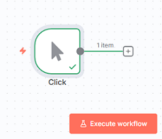
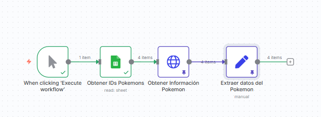
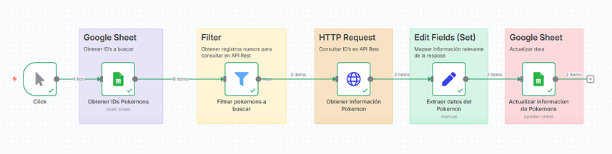
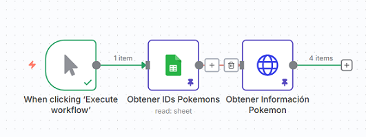
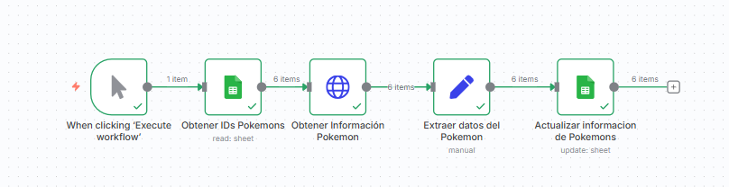
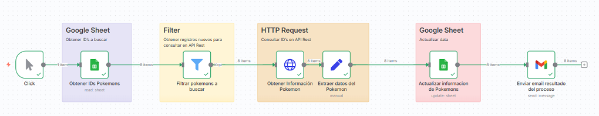
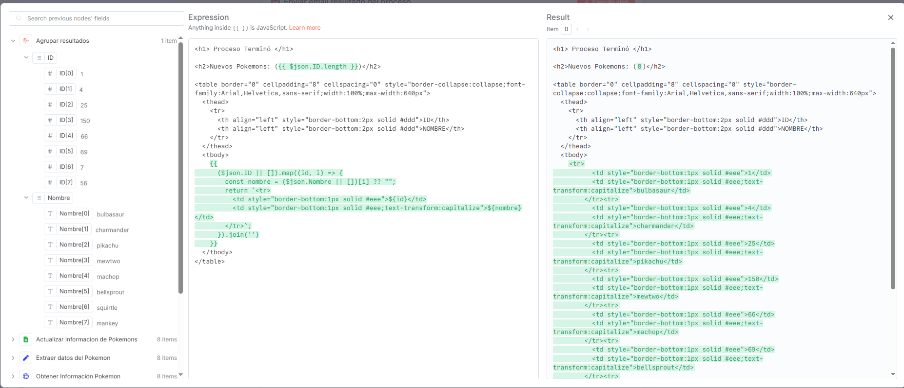
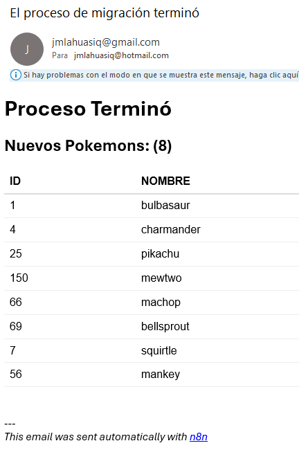

# 📘 Introducción a n8n

En esta sección aprenderás los **conceptos fundamentales de n8n**, necesarios para comprender cómo se estructuran, ejecutan y conectan los workflows automatizados.

---

## 📑 Temario

- 🔹 [Nodos en n8n](#-nodos-en-n8n)
- 🔹 [Tipos de nodos](#-diferencia-entre-tipos-de-nodos-en-n8n)
- 🔹 [Nodos prácticos](#️-nodos-prácticos-ejemplos-más-usados)
- 🔹 [Buenas prácticas](#️-buenas-prácticas-en-nodos)

---

## 🔹 Nodos en n8n

### 🧩 ¿Qué son los nodos y cómo funcionan dentro de un workflow?

En n8n, los **nodos** son los **bloques fundamentales** de un flujo de trabajo.  
Cada nodo cumple una función específica: **recibir datos, procesarlos o enviarlos** a otra aplicación o servicio.

- 🔗 Los nodos se **conectan visualmente** entre sí para definir la secuencia del flujo.
- 🔄 El workflow se ejecuta **siguiendo el orden lógico** de conexión.
- ♻️ Un mismo nodo puede reutilizarse en distintos flujos con configuraciones diferentes.

---

## 🧭 Diferencia entre tipos de nodos en n8n

Cada **nodo** cumple un rol específico dentro del flujo.  
En general, se agrupan en **tres categorías principales**:

---

### 1️⃣ ⏱️ Trigger Nodes (Nodos disparadores)

Los **Trigger Nodes** son los que **inician la ejecución** de un workflow.  
Se activan cuando ocurre un evento o se cumple una condición (como recibir un correo, detectar un archivo nuevo o ejecutar una tarea programada).

#### 🔹 Características

- No requieren entrada de datos.
- Son el **punto de inicio** del flujo.
- Se ejecutan manualmente o ante un evento externo.

#### 🔹 Ejemplos comunes

- `Webhook` → se activa al recibir una solicitud externa.
- `Gmail Trigger` → se activa al recibir un correo.
- `Cron` → ejecuta flujos según un intervalo.
- `Manual Trigger` → se ejecuta manualmente desde el editor.

👉 Estos nodos son los **disparadores del flujo**.

#### ⚡ Ejemplo práctico: Configuración de nodos de entrada

Este ejemplo muestra cómo iniciar un workflow y leer datos desde **Google Sheets**.

- [Trigger Manually](./tool-n8n-node-trigger-manually.md)  
  

- [Leer Google Sheet](./tool-n8n-node-google-sheet-read.md)  
  

---

### 2️⃣ ⚙️ Nodos de procesamiento / transformación

Estos nodos representan el **núcleo lógico del workflow**.  
Se encargan de **procesar, filtrar o transformar los datos** antes de enviarlos a los nodos de salida.

#### 🔹 Características

- Manipulan los datos intermedios del flujo.
- Aplican cálculos, filtros o condiciones lógicas.
- Permiten crear estructuras nuevas con expresiones o scripts.

#### 🔹 Ejemplos comunes

- `Set` → crea o edita campos.
- `Function` → ejecuta código JavaScript personalizado.
- `If` → aplica lógica condicional.
- `Aggregate` → agrupa o resume información.

👉 Aquí es donde se define la **inteligencia del flujo**.

#### ⚡ Ejemplo práctico: Editar, agregar y transformar datos

Se organiza y modifica la información antes de enviarla al destino final.

- [Editar y transformar data con `Edit Fields (Set)`](./tool-n8n-node-edit-fields-set.md)  
  

---

#### ⚡ Ejemplo práctico: Filtrar información

Evita volver a consultar datos ya procesados en el `API Rest` para optimizar costos y rendimiento.

- [Filtrar información actualizada con `Filter`](./tool-n8n-node-filter.md)  
  

---

#### ⚡ Ejemplo práctico: Consolidar información (Aggregate)

Combina múltiples registros en un solo resultado, útil para generar reportes o enviar notificaciones agrupadas.

- [Consolidado de registros actualizados con `Aggregate`](./tool-n8n-node-aggregate.md)  
  

---

### 3️⃣ 📤 Nodos de salida

Los **nodos de salida** son los que **envían el resultado final** del flujo a otra aplicación o servicio externo.  
Estos nodos cierran el ciclo de automatización.

#### 🔹 Características

- Transmiten los datos procesados a su destino.
- Pueden escribir en una base de datos, enviar correos o llamar APIs.
- Permiten verificar la salida final del flujo.

#### 🔹 Ejemplos comunes

- `HTTP Request` → envía datos a una API externa.
- `Google Sheets` → actualiza hojas de cálculo.
- `Slack` → envía mensajes o alertas.
- `Postgres` → actualiza registros en una base de datos.

👉 Son los **destinos finales del flujo**.

#### ⚡ Ejemplo práctico: Integración con API externa

Uso de **Google Sheets** como fuente de datos y un nodo **HTTP Request** como salida.

- [Leer API REST con `HTTP Request`](./tool-n8n-node-http-request.md)  
  

---

#### ⚡ Ejemplo práctico: Actualizar datos en Google Sheets

Actualiza registros existentes con información procesada dentro del flujo.

- [Actualizar información en `Google Sheet`](./tool-n8n-node-google-sheet-update.md)  
  

---

#### ⚡ Ejemplo práctico: Notificación por correo (Gmail)

Envía un correo por cada registro actualizado en Google Sheets.

- [Enviar email con `Gmail`](./tool-n8n-node-gmail-send-message.md)  
  

---

#### ⚡ Ejemplo práctico: Enviar consolidado por correo (Gmail + Aggregate)

Envía un correo único con una tabla HTML que contiene los registros agrupados del proceso.

- [Consolidar registros con `Aggregate`](./tool-n8n-node-aggregate.md)  
  

- Modificación del nodo `Gmail` para incluir información agrupada:
  

- Ejemplo del correo recibido:

  

  

---

## ✅ Resumen general

| Tipo de Nodo                       | Función principal                      | Ejemplos                           | Rol en el flujo |
| ---------------------------------- | -------------------------------------- | ---------------------------------- | --------------- |
| **Trigger Nodes**                  | Inician el flujo ante un evento        | Webhook, Cron, Manual Trigger      | Entrada         |
| **Procesamiento / Transformación** | Manipulan, filtran y transforman datos | Set, Function, If, Aggregate       | Lógica central  |
| **Salida**                         | Envían resultados a otros servicios    | HTTP Request, Google Sheets, Gmail | Destino final   |

---

💡 **Consejo:**  
Piensa en los nodos como una línea de flujo de datos:

```txt
[ Trigger ] → [ Procesamiento / Transformación ] → [ Salida ]
```

Cada categoría cumple un rol esencial dentro de un workflow eficiente y modular.

---

## ⚙️ Nodos prácticos (ejemplos más usados)

- 📊 **Google Sheets** → leer, escribir y actualizar hojas de cálculo.
- ✉️ **Gmail** → enviar y recibir correos electrónicos.
- 🌐 **HTTP Request** → consumir APIs externas.
- ✏️ **Edit (Set / Function)** → crear o modificar datos intermedios.
- 🧮 **Aggregate** → agrupar, sumar y calcular métricas a partir de datos.

---

## 🏷️ Buenas prácticas en nodos

- Asigna **nombres descriptivos** a cada nodo (por ejemplo: `Leer_Clientes` o `Actualizar_Pedidos`).
- Usa **colores o etiquetas** para diferenciar funciones (Entrada / Proceso / Salida).
- Reutiliza **plantillas de nodos configurados** para acelerar futuros desarrollos.
- Documenta con comentarios dentro del flujo.

---

## 🔗 Navegación

[🏠 INICIO](./README.md) │ [⬅️ ANTERIOR](./01-n8n.md) │ [➡️ SIGUIENTE](./02-INTRO.md)
