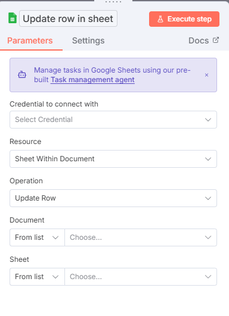
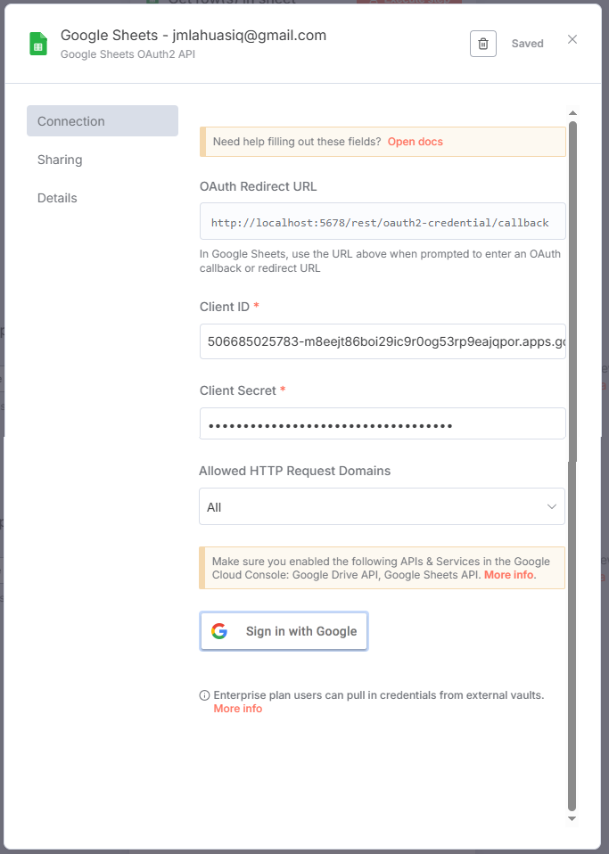
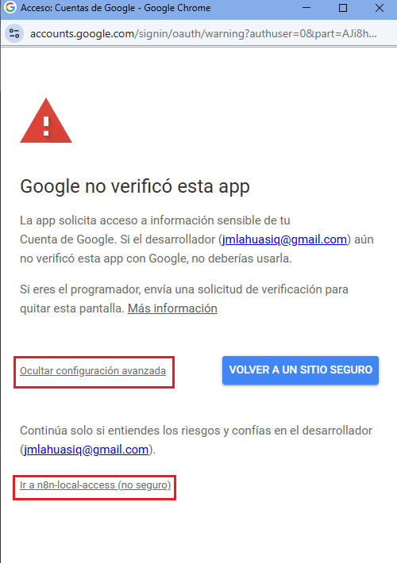
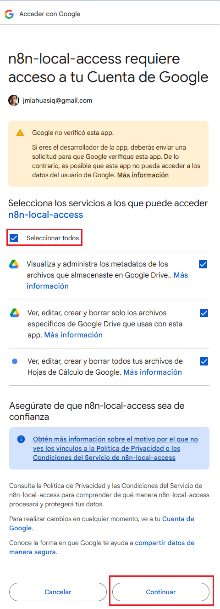
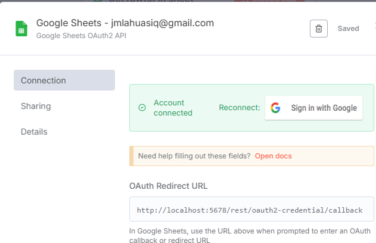

# 🔑 Crear credenciales en n8n (Google OAuth)

Una vez creadas las credenciales en **Google Cloud**, debemos configurarlas en **n8n** para integrarlas con Gmail, Google Sheets y Google Drive.

---

## 📑 Pasos detallados

### 1️⃣ Añadir credenciales en n8n

- Ir a la sección de **Credenciales** en n8n.
- Seleccionar **Añadir nuevas credenciales**.
- Escoger el tipo **Google OAuth2 API**.

---

### 2️⃣ Configurar cliente OAuth

- Configura credenciales `OAuth2` configuradas en `Google Cloud`.
- Haz clic en **Sign in with Google**.
- Inicia sesión con la cuenta de Google que configuraste en el proyecto.

---

### 3️⃣ Continuar con configuración

⚠️ **Nota importante**: Gmail puede tardar en reflejar permisos recién configurados en Google Cloud.

- Si aparece un mensaje de **“modo no seguro”**, continúa aceptando la advertencia.

---

### 4️⃣ Seleccionar permisos (Scopes)

- Escoge los **alcances** que definiste en tu Pantalla de Consentimiento (ejemplo: acceso a Gmail, Google Sheets, Google Drive).
- Confirma para otorgar los permisos a n8n.

---

### 5️⃣ Verificar conexión

- Una vez guardadas las credenciales, n8n probará la conexión automáticamente.
- Si es correcta, verás el mensaje de conexión exitosa.

---

## ✅ Resultado esperado

Con estos pasos habrás:

- Creado credenciales OAuth en Google Cloud.
- Conectado esas credenciales a n8n.
- Verificado el acceso a Gmail y Google Sheets mediante un nodo de prueba.
