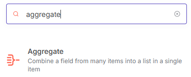
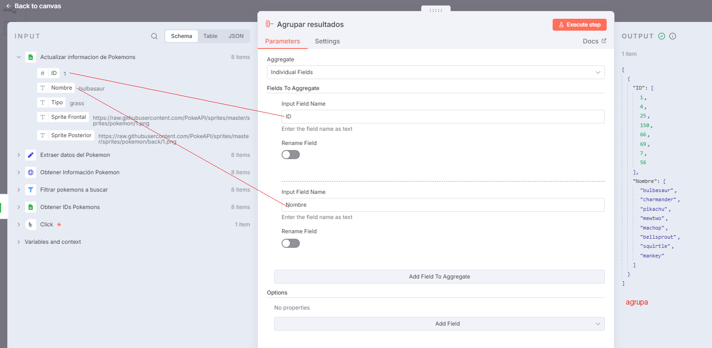

# 🧮 Aggregate

El nodo **Aggregate** se utiliza para **agrupar, combinar o resumir datos** dentro de un workflow en n8n.  
Es especialmente útil cuando necesitas **contar, sumar, promediar o unir registros** provenientes de una fuente como Google Sheets o una API.

> 💡 **Uso común:** generar reportes, combinar datos repetidos o consolidar resultados antes de enviarlos a otro servicio.

---

## 1️⃣ Buscar y añadir el nodo `Aggregate`

- En el buscador de nodos, escribe **Aggregate**.
- Agrégalo después de un nodo que produzca múltiples registros (por ejemplo, `Google Sheets`, `HTTP Request` o `Function`).

> 📘 **Ejemplo:** agrupar registros por “cliente” para calcular el total de ventas por persona.

---

## 2️⃣ Configurar los campos y ejecutar el nodo

- Define las **columnas o propiedades** por las que deseas agrupar.
- Selecciona el tipo de **operación** a realizar sobre los datos agrupados:
  - `Count` → contar el número de elementos.
  - `Sum` → sumar valores numéricos.
  - `Average` → calcular el promedio.
  - `Concat` → unir valores de texto.
  - `Min` / `Max` → obtener valores mínimos o máximos.
- Haz clic en **Execute Node** para ver los resultados de la agrupación.

> 💡 **Tip:** Puedes combinar múltiples operaciones dentro del mismo nodo (por ejemplo, agrupar por “cliente” y sumar “ventas”).

---

## 3️⃣ Verificar el funcionamiento del nodo

- Si la configuración es correcta, el nodo mostrará un **✅** indicando que la operación fue exitosa.
- Revisa el **Output** para confirmar que los datos se agruparon o resumieron según lo esperado.

---

## ✅ Resultado esperado

Con el nodo **Aggregate** podrás:

- Agrupar información por una o varias columnas clave.
- Calcular totales, promedios o recuentos de registros.
- Consolidar datos para reportes o integraciones posteriores.

> 💡 **Ejemplo práctico:**  
> Agrupar las ventas por mes y sumar el total antes de enviar el resultado a un dashboard o a un nodo `Google Sheets (Update)`.
