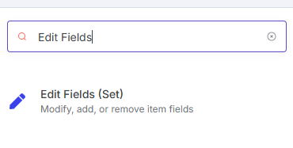
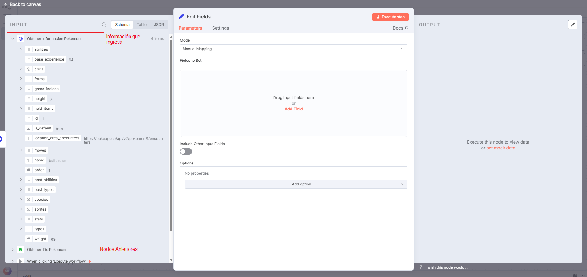
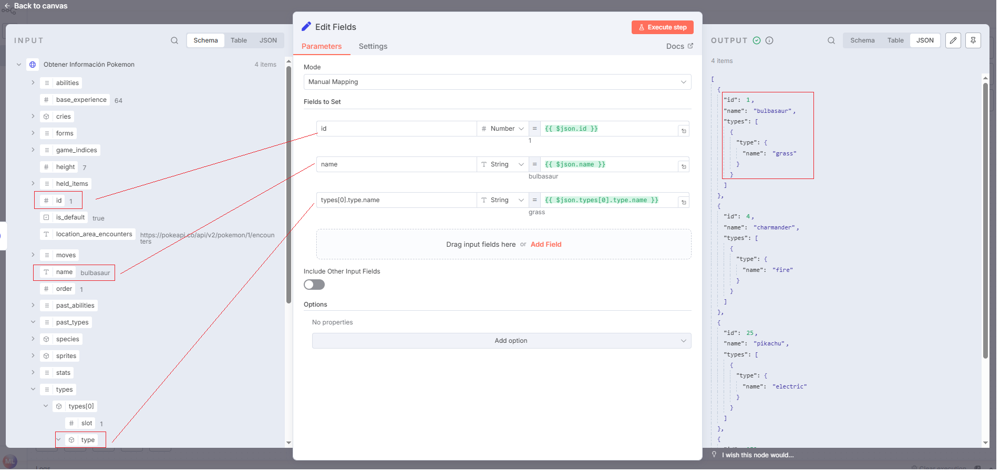
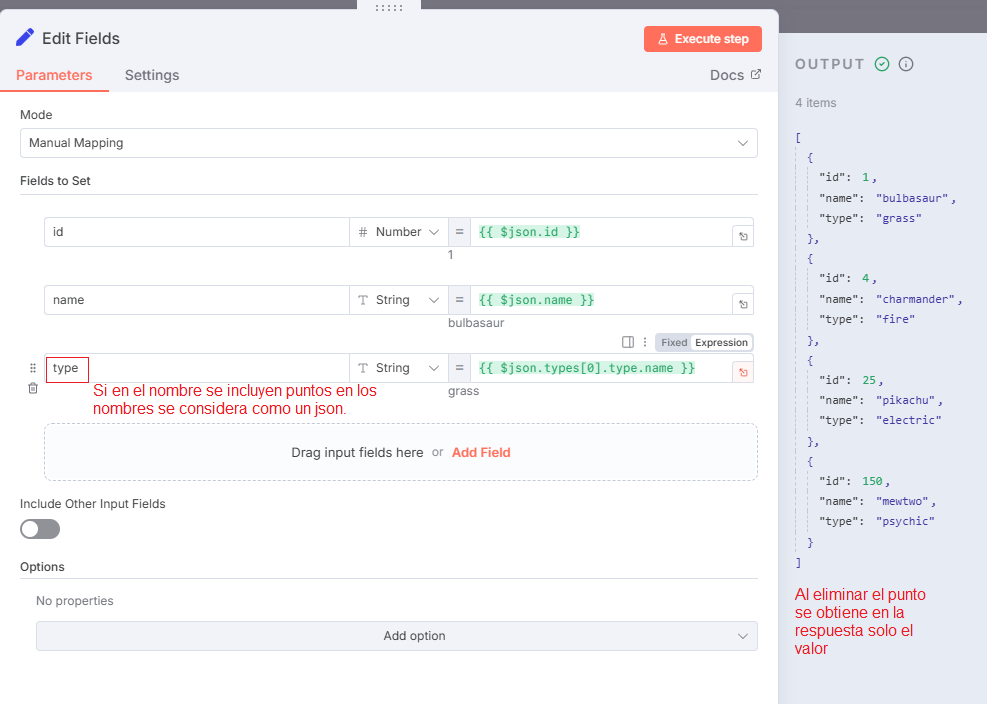
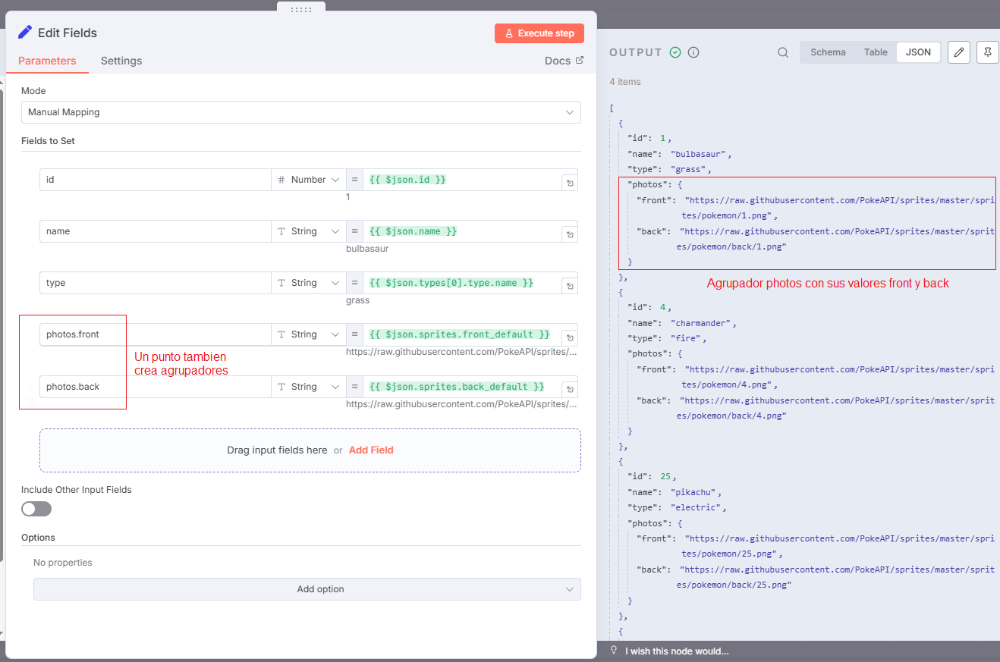

# 🧩 Edit Fields (Set)

El nodo **Edit Fields (Set)** se utiliza para **crear, editar o transformar campos** dentro de un workflow.  
Permite modificar la estructura de los datos, renombrar propiedades o generar nuevos valores antes de enviarlos a otro nodo.

> 💡 **Uso común:** preparar datos para una API, limpiar resultados de una consulta o agrupar información antes de guardarla en una base de datos o Google Sheets.

---

## 1️⃣ Buscar y añadir el nodo `Edit Fields (Set)`

- En el buscador de nodos, escribe `Set` o `Edit Fields`.
- Añádelo al flujo después de un nodo que genere datos (por ejemplo, `HTTP Request`, `Webhook` o `Google Sheets`).



---

## 2️⃣ Comprender las entradas del nodo

- El nodo **recibe automáticamente** los datos del nodo anterior.
- También puede **acceder a información de nodos previos**, incluso si no están conectados directamente, utilizando el **selector de expresiones** (`{{ }}`).



> 📘 **Ejemplo:** puedes acceder a valores del nodo `HTTP Request` aunque esté varias posiciones antes en el flujo.

---

## 3️⃣ Arrastrar datos hacia `Parameters`

- En el panel derecho, los datos disponibles se muestran en formato de lista o árbol.
- **Arrastra los campos** que necesites hacia la sección **Parameters** del nodo `Set`.
- Esto crea **expresiones dinámicas**, las cuales vinculan los valores reales del flujo actual.



> 💡 **Consejo:** puedes combinar campos fijos con valores dinámicos, por ejemplo:  
> `Customer: {{$json["name"]}} ({{$json["email"]}})`

---

## 4️⃣ Trabajar con campos anidados (`.`)

Cuando los nombres de los campos contienen puntos (`.`), n8n los interpreta como **propiedades anidadas dentro de un objeto JSON**.

Por ejemplo:

- Campo: `types[0].type.name`  
  Resultado:

```json
"types": [
  {
    "type": {
      "name": "grass"
    }
  }
]

```

- Campo: `type`
  Resultado:

```json
"type": "grass"
```



> ⚙️ Nota: este comportamiento es útil cuando trabajas con APIs o estructuras de datos complejas que requieren jerarquías JSON.

---

## 5️⃣ Crear agrupadores con puntos (.)

El uso del punto también permite **agrupar varios valores relacionados** bajo un mismo objeto o categoría, manteniendo los datos organizados.



> 💡 Ejemplo:
> Crear un grupo user.name y user.email generará:

```json
"user": {
  "name": "John",
  "email": "john@example.com"
}
```

---

## 6️⃣ Ejecutar y verificar el nodo

> - Ejecuta el workflow para comprobar la salida del nodo `Set`.
> - Si se muestra el resultado esperado, el nodo aparecerá con un ✅.


---

## ✅ Resultado esperado

Con el nodo **Edit Fields (Set)** puedes:

> - 🧱 Crear o editar campos personalizados.
> - 🔄 Transformar estructuras de datos complejas en formatos simples.
> - 🗂️ Agrupar y organizar información de forma jerárquica.
> - 🚀 Preparar los datos antes de enviarlos a un nodo de salida (API, base de datos, Google Sheets, etc.).

---

> 💡 **Consejo adicional**: usa el nodo `Set` como punto de control entre integraciones.
> Te permite visualizar y depurar los datos antes de continuar con el siguiente paso del flujo.
