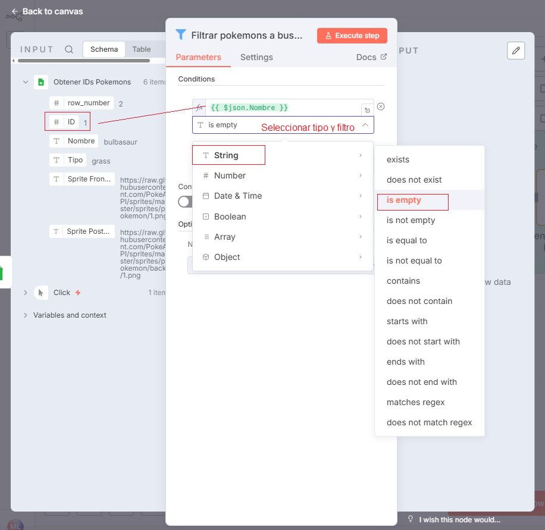
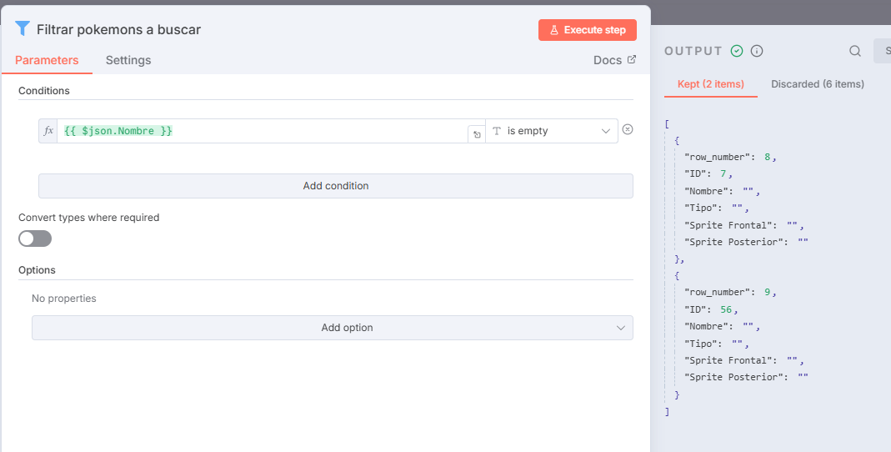

# 🔍 Filter (Nodo de filtrado)

El nodo **Filter** en n8n se utiliza para **filtrar datos basándose en condiciones específicas**.  
Permite decidir qué elementos del flujo pasan al siguiente nodo y cuáles se descartan, funcionando como un punto de control dentro del workflow.

> 💡 **Uso común:**  
> Excluir registros vacíos, validar condiciones antes de ejecutar una acción o evitar duplicados.

---

## 1️⃣ Buscar y añadir el nodo `Filter`

- En el editor, busca el nodo **Filter** en el punto del flujo donde quieras aplicar el filtrado.
- Este nodo se puede conectar después de cualquier nodo que genere datos (por ejemplo, `Google Sheets`, `HTTP Request` o `Set`).

---

## 2️⃣ Configurar las condiciones del filtro

- Define las **reglas o condiciones** que determinarán si un elemento debe pasar al siguiente nodo.
- Puedes comparar campos, valores o expresiones dinámicas.
- Ejemplo: mostrar solo registros donde el campo `email` no esté vacío o el valor `status` sea `"Activo"`.

> ⚙️ **Campos comunes:**
>
> - **Field:** propiedad a evaluar (por ejemplo, `email`, `status`, `id`).
> - **Operation:** tipo de comparación (`equals`, `not empty`, `contains`, etc.).
> - **Value:** valor de referencia para la condición.

---

## 3️⃣ Ejecutar el nodo

- Haz clic en **Execute Step** o **Execute Node** para probar la condición.
- Solo los **registros que cumplan la condición** pasarán al siguiente nodo del flujo.
- Los que no la cumplan serán descartados (no generan salida).

> 📊 En este ejemplo, el filtro muestra únicamente los registros **que no tienen datos** (campos vacíos).

---

## 4️⃣ Verificar el funcionamiento

- Si el nodo funciona correctamente, verás un **✅** junto al nombre del nodo.
- Los datos de salida (`Output`) deben coincidir con los elementos que cumplen las condiciones configuradas.

---

## 🧠 Nota importante

En este ejemplo, si **no hay registros nuevos**, el nodo **no envía datos al siguiente nodo**.  
Esto es útil para evitar ejecutar acciones innecesarias en workflows automatizados (por ejemplo, evitar llamadas a APIs cuando no hay información nueva que procesar).

---

## ✅ Resultado esperado

Con el nodo **Filter** puedes:

- Aplicar condiciones lógicas sobre los datos de entrada.
- Evitar procesar información vacía o irrelevante.
- Controlar el flujo del workflow con precisión.

> 💡 **Ejemplo práctico:**  
> Usar el nodo Filter para verificar si una hoja de Google Sheets contiene nuevos registros antes de enviar los datos a una API externa.
