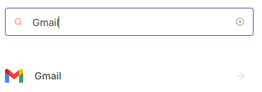
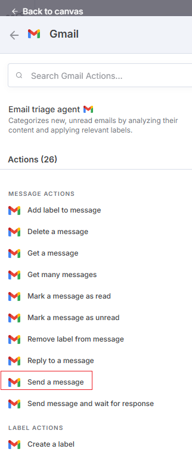
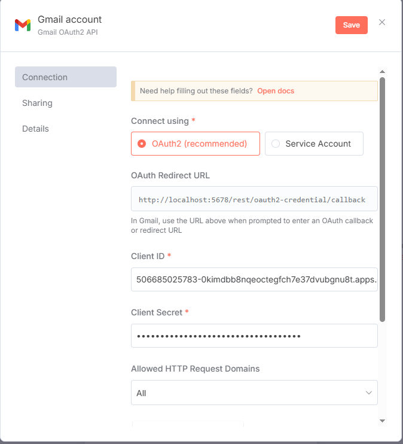
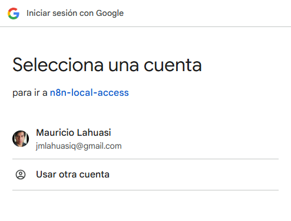
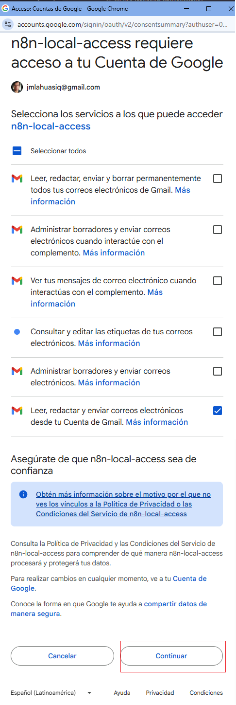
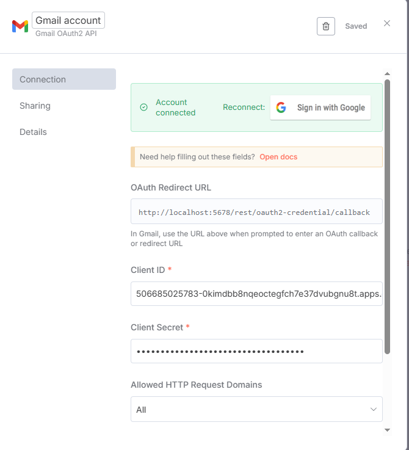
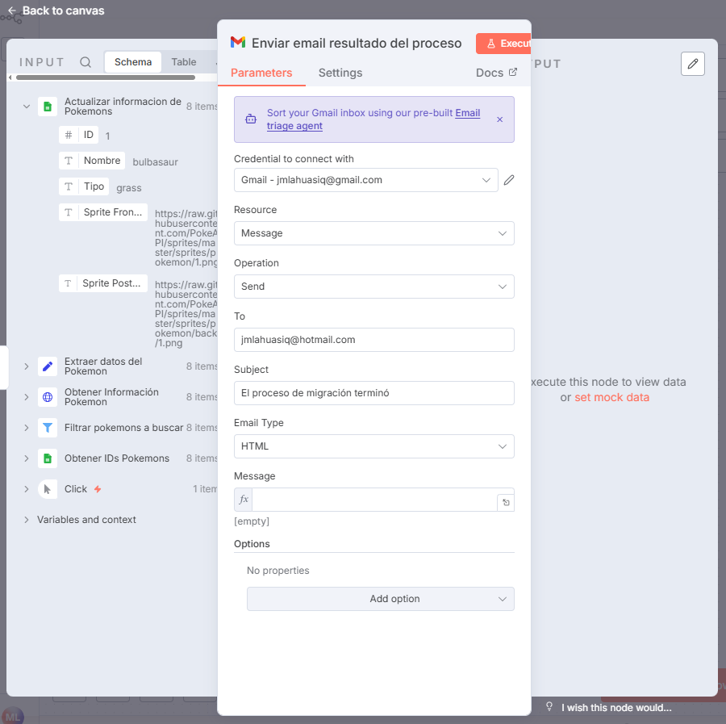
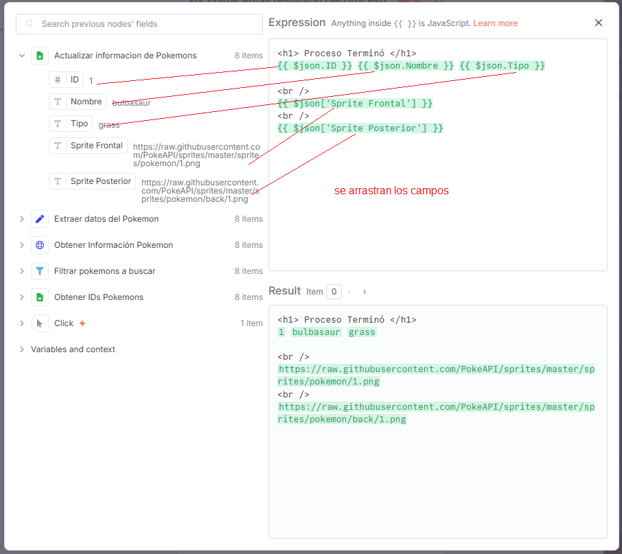
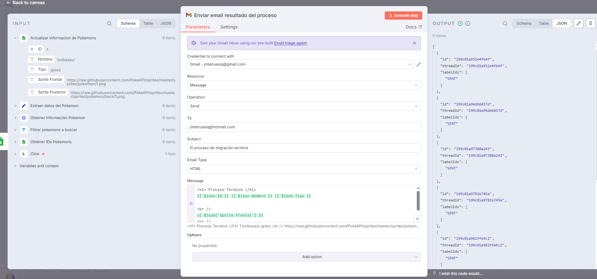
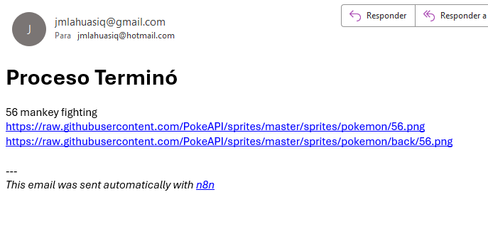

# 📧 Gmail (Send a Message)

El nodo **Gmail (Send a Message)** permite enviar correos electrónicos directamente desde un workflow en n8n, utilizando la **API de Gmail** y las **credenciales OAuth2** configuradas en Google Cloud.

> 💡 **Uso común:** enviar notificaciones automáticas, alertas, reportes o confirmaciones personalizadas a partir de datos procesados.

---

## 1️⃣ Buscar y añadir el nodo `Gmail`

- En el buscador de nodos, escribe **Gmail**.
- Añade el nodo al flujo donde desees enviar los mensajes.



---

## 2️⃣ Seleccionar la acción

- Dentro del nodo, selecciona la acción **Send a Message** para enviar correos.



---

## 3️⃣ Configurar credenciales OAuth2

⚠️ **Importante:** antes de enviar correos, debes crear y vincular tus credenciales en Google Cloud.

### 🔹 Paso 1: Crear credenciales en Google Cloud

- Sigue esta guía: [Crear credenciales en Google Cloud](../../tools/google-cloud/create-key-google-credentials/tool-google-credentials.md)

> 💡 **Nota:** La API de Google Drive también debe estar habilitada, ya que Gmail comparte autenticación con otros servicios de Google.

---

### 🔹 Paso 2: Configurar credenciales en el nodo `Gmail`

- Abre el nodo y selecciona **Connect Credentials**.
- Clic en **Sign in with Google**.



---

### 🔹 Paso 3: Seleccionar la cuenta y otorgar permisos

1. Elige la cuenta de Google con la que enviarás correos.
2. Revisa los permisos solicitados y haz clic en **Continuar**.





---

### 🔹 Paso 4: Verificar conexión exitosa

- Una vez completado el proceso, n8n confirmará que la cuenta está correctamente conectada.



---

## 4️⃣ Configurar el nodo `Gmail`

- Especifica los parámetros del correo:



---

## 5️⃣ Configurar contenido HTML

- En la pestaña **HTML**, redacta el contenido del correo usando formato HTML.
- Puedes incluir expresiones dinámicas para personalizar los mensajes (por ejemplo: nombre del cliente, fecha, etc.).



> 💡 **Ejemplo:**
>
> ```html
> <h2>Hola {{$json["name"]}}!</h2>
> <p>Tu solicitud fue procesada con éxito el {{$json["date"]}}.</p>
> ```

---

## 6️⃣ Ejecutar el nodo

- Haz clic en **Execute Step** para enviar el mensaje de prueba.



---

## 7️⃣ Resultado: correos enviados

- Por cada registro procesado (por ejemplo, desde Google Sheets), se enviará un correo independiente.
- Puedes verificar en tu bandeja de entrada los correos enviados desde el flujo.


---

## 8️⃣ Verificar el formato del correo

- Cada mensaje incluirá el formato HTML configurado en el nodo `Gmail`.



---

## 9️⃣ Verificar el nodo Gmail

- Si la ejecución fue exitosa, el nodo mostrará un **✅** indicando que el correo fue enviado correctamente.


---

## ✅ Resultado esperado

Con este flujo podrás:

- Conectarte de forma segura con Gmail mediante OAuth2.
- Enviar correos personalizados y automatizados.
- Incorporar variables dinámicas en el cuerpo del mensaje (HTML o texto plano).
- Integrar Gmail con otros nodos como `Google Sheets`, `Webhook` o `HTTP Request`.

---

💡 **Ejemplo práctico:**  
Enviar un correo automático a cada usuario listado en Google Sheets confirmando la recepción de su solicitud o reporte.
