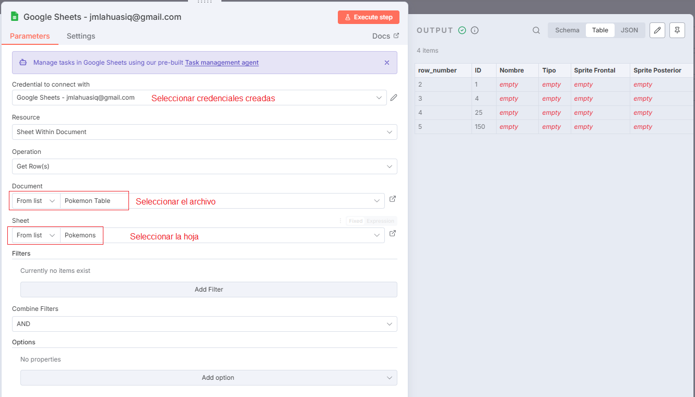

# 📊 Google Sheets (Read)

El nodo **Google Sheets (Read)** permite **leer datos desde una hoja de cálculo** en Google Sheets directamente dentro de un workflow de n8n.  
Es ideal para automatizar reportes, importar información o validar registros antes de ejecutar otros procesos.

---

## 1️⃣ Configurar credenciales de Google

⚠️ **Importante:** antes de usar cualquier nodo de Google (Sheets, Gmail o Drive), debes crear y vincular las credenciales OAuth2 en Google Cloud.

1. [Crear credenciales en Google Cloud](../../tools/google-cloud/create-key-google-credentials/tool-google-credentials.md)
2. [Habilitar Google Sheets API, Gmail API y Google Drive API](../../tools/google-cloud/habilitar-google-sheet/tool-habilitar-servicios.md)

> 💡 **Tip:** La API de Google Drive es necesaria porque las hojas de cálculo se almacenan dentro de Drive.

---

## 2️⃣ Añadir un nodo de Google Sheets

- Haz clic en el conector **(+)** desde tu nodo Trigger o desde otro nodo previo.
- Usa el buscador y selecciona **Google Sheets**.

---

## 3️⃣ Seleccionar la acción “Read”

- Dentro del nodo, selecciona la acción **Get Row(s) in Sheet**.
- Esta opción permite **leer registros** de una hoja específica.
- Puedes usar filtros, rangos o condiciones para obtener solo los datos que necesites.

---

## 4️⃣ Asignar credenciales OAuth2

- Selecciona las credenciales OAuth2 creadas previamente.
- Si aún no las has configurado, sigue esta guía:  
  [Configurar credenciales en n8n](./tool-n8n-create-credential.md)

---

## 5️⃣ Probar las credenciales en el nodo

- Ejecuta el workflow o el nodo individualmente con **Execute Step**.
- Verifica que los datos se lean correctamente desde la hoja.

> 💡 **Tip:** Si obtienes error de autenticación, revisa que la cuenta conectada tenga acceso al archivo.

---

## 6️⃣ Confirmar el funcionamiento

- Si el nodo se ejecuta sin errores y devuelve las filas esperadas, la integración está lista.
- Los datos leídos se mostrarán en la sección de salida del nodo (Output).

---

## ✅ Resultado esperado

Con este ejemplo habrás aprendido a:

- Conectar un nodo de **Google Sheets**.
- Configurar y validar credenciales **OAuth2**.
- Leer y visualizar datos desde una hoja de cálculo de Google.
- Confirmar que la conexión entre n8n y Google Sheets funciona correctamente.

---

💡 **Ejemplo de uso práctico:**  
Leer datos de una hoja de clientes para luego enviarlos a una API externa, actualizar otra hoja o generar reportes automáticos.
