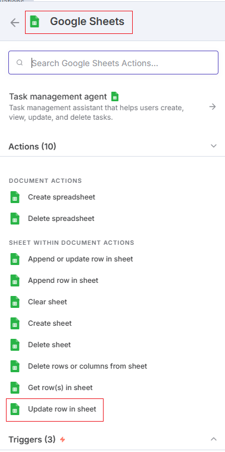
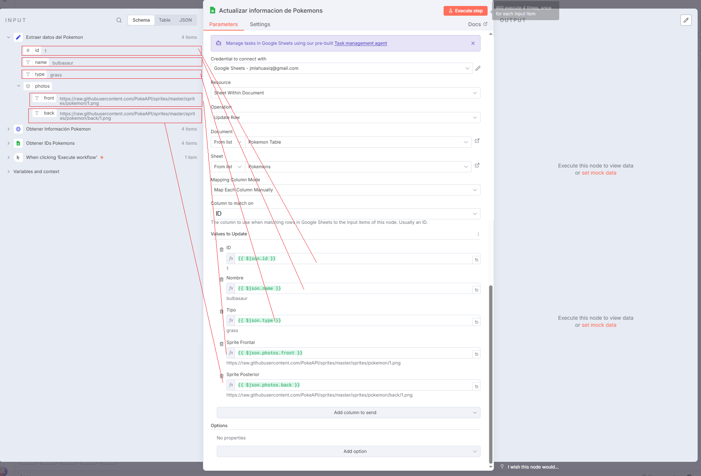
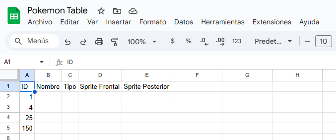
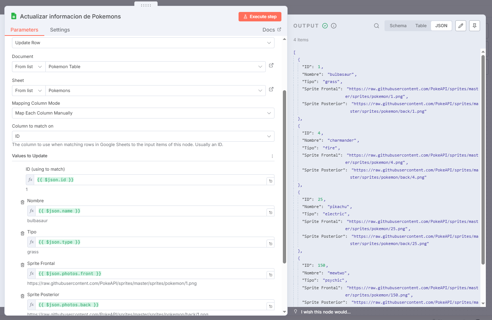
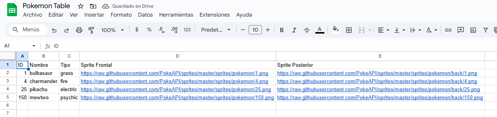

# 📊 Google Sheets (Update)

El nodo **Google Sheets (Update)** permite **modificar registros existentes** dentro de una hoja de cálculo de Google Sheets.  
Es útil para actualizar información ya almacenada, como estados, valores calculados o resultados de otros nodos dentro de un workflow.

---

## 1️⃣ Buscar y añadir el nodo Google Sheets

- En el buscador de nodos, escribe **Google Sheets**.
- Selecciona la acción **Update Row in Sheet** para modificar una fila existente.

> 💡 **Uso común:** actualizar el estado de una orden, cambiar valores de una fila existente o sincronizar datos con una API externa.

---

## 2️⃣ Configurar los parámetros

En la configuración del nodo, define los parámetros que van a actualizar los campos del `Google Sheet`.

> 💡 **Consejo:**  
> Puedes usar **expresiones dinámicas** para rellenar valores desde otros nodos, como `Set`, `Webhook` o `HTTP Request`.  
> Ejemplo: `{{$json["email"]}}` o `{{$node["HTTP Request"].json["status"]}}`.

---

## 3️⃣ Ejecutar la actualización manualmente

Ahora probaremos la actualización para verificar que el flujo funcione correctamente.

### 📄 Antes de ejecutar

La hoja de cálculo se encuentra vacía o con los datos previos sin actualizar:  

---

### ▶️ Ejecutar el nodo

Haz clic en **Execute Step** para ejecutar la acción manualmente.  
El nodo enviará los datos configurados a la hoja seleccionada.

---

### ✅ Resultado después de ejecutar

Si la configuración es correcta, los datos se actualizarán inmediatamente en la hoja.  
Podrás ver los nuevos valores reflejados.

---

## 4️⃣ Ejecutar el flujo completo

Una vez que el nodo funcione correctamente, puedes ejecutar todo el workflow para validar la integración completa.

> 📘 **Tip:** al ejecutar el flujo completo, puedes conectar este nodo con un `Trigger`, `HTTP Request` o `Webhook` para automatizar el proceso.

---

## ✅ Resultado esperado

Con este workflow podrás:

- 🔗 Conectarte a una hoja de cálculo de **Google Sheets**.
- ✏️ Actualizar registros específicos automáticamente.
- ⚙️ Integrar resultados de otras APIs o procesos dentro de n8n.
- 🚀 Sincronizar tus datos en tiempo real sin intervención manual.

---

💡 **Ejemplo práctico:**  
Recibir información de una API (por ejemplo, resultados de validación o estado de pedido) y actualizar la fila correspondiente en tu hoja de cálculo automáticamente.
