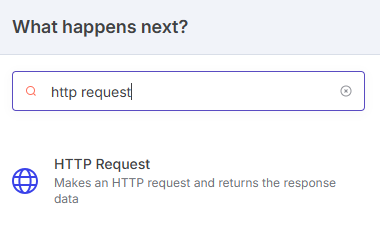
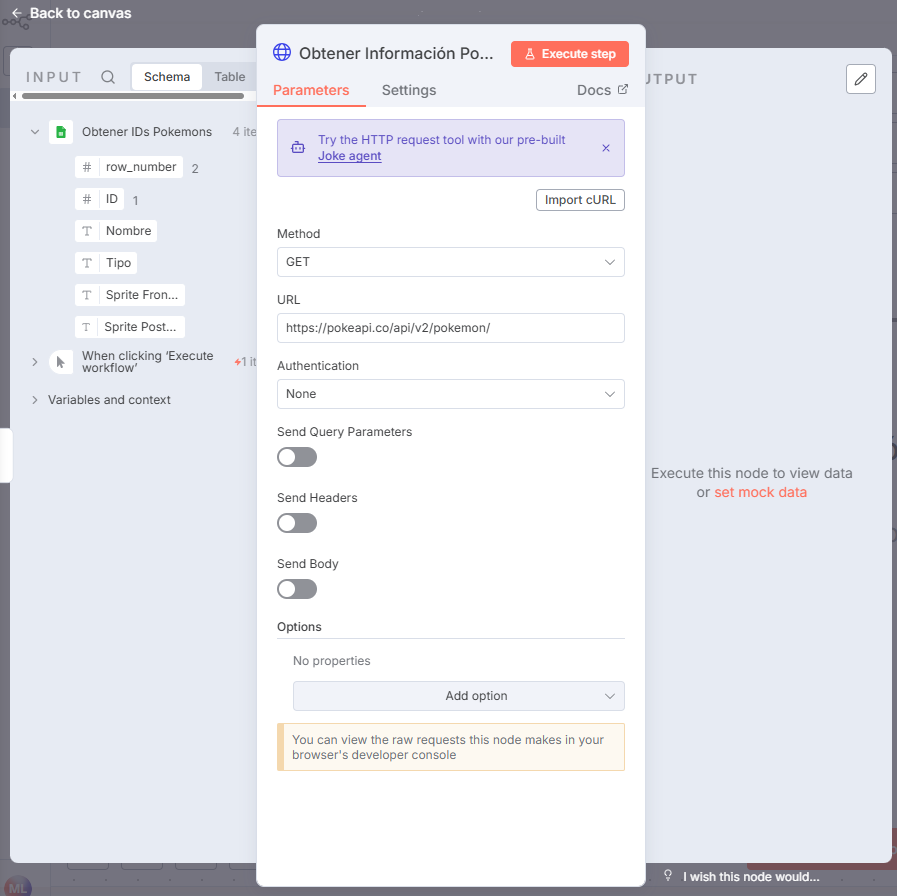
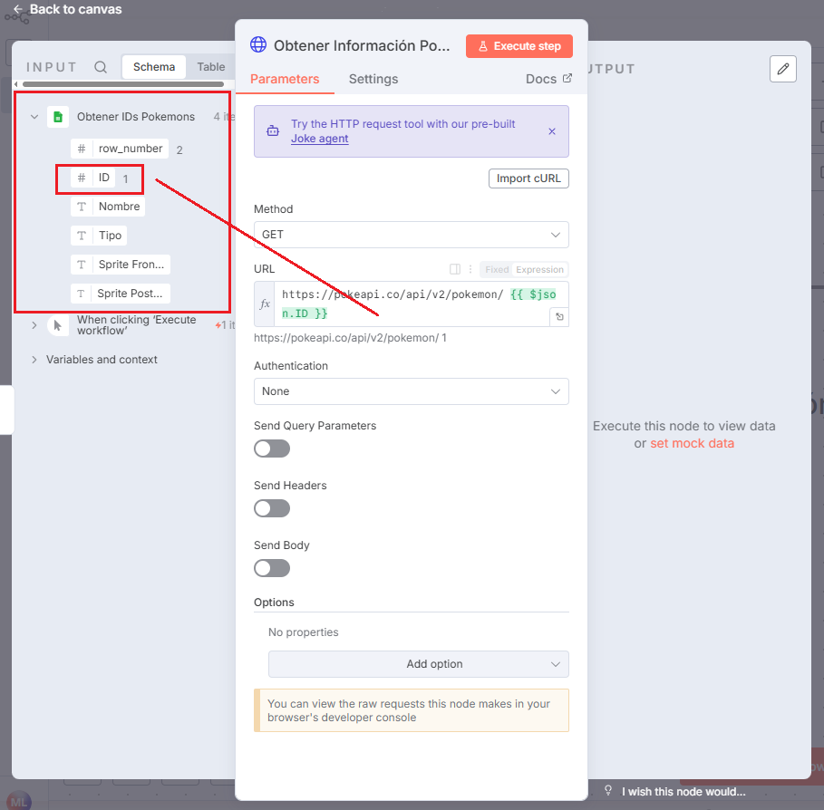
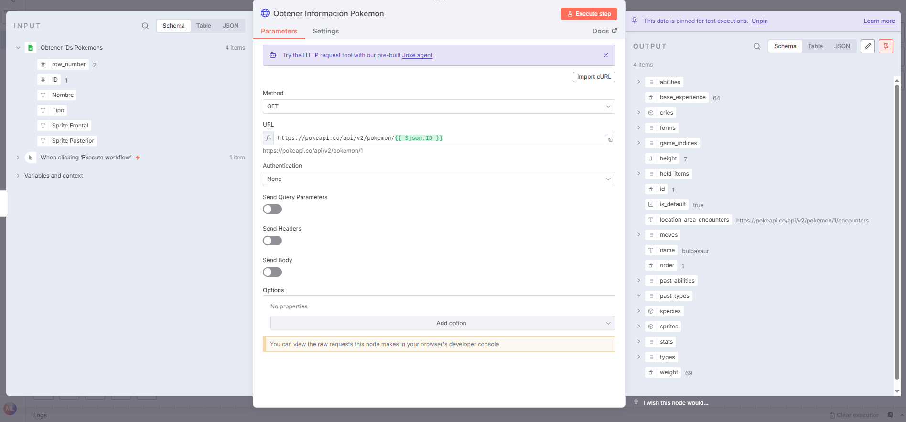

# 🌐 HTTP Request

El nodo **HTTP Request** permite a n8n **enviar y recibir datos de APIs externas**, conectando tu flujo con servicios web, sistemas internos o endpoints personalizados.  
Es uno de los nodos más versátiles, ya que puede comunicarse con prácticamente cualquier API que soporte HTTP o HTTPS.

---

## 1️⃣ Buscar y añadir el nodo `HTTP Request`

- Abre el buscador de nodos y escribe **HTTP Request**.
- Este nodo permite **enviar datos hacia una URL o API externa** mediante métodos como `GET`, `POST`, `PUT`, `PATCH` o `DELETE`.

> 💡 **Uso común:**  
> Obtener información desde una API (`GET`), enviar datos procesados (`POST`), o actualizar registros externos (`PUT`).

---

## 2️⃣ Configurar el nodo `HTTP Request`

### a) Especificar la URL de la API

- Introduce la **URL base** del servicio o endpoint al que deseas conectarte.
- Puedes escribirla directamente o construirla con expresiones dinámicas.

> 📘 **Ejemplo:**  
> `https://api.example.com/users`  
> o dinámicamente:  
> `https://api.example.com/users/{{$json["userId"]}}`

---

### b) Añadir parámetros dinámicos

- A la izquierda verás los datos provenientes del nodo anterior (por ejemplo, **Google Sheets**).
- Arrastra uno de esos campos hasta la **URL** o hasta el cuerpo de la solicitud para crear una **expresión dinámica**.
- Esto permite enviar valores personalizados obtenidos de otros nodos (como un ID, nombre o email).
- Haz clic en **Execute Node** para probar la petición.

> ⚙️ **Nota:**  
> También puedes definir parámetros de consulta (`Query Parameters`), cabeceras personalizadas (`Headers`) o cuerpo (`Body`) según los requerimientos de la API.

---

### c) Ver los datos obtenidos

- Si la API responde correctamente, los resultados aparecerán en la salida del nodo (`Output`).
- Activa el **pin (📌)** en la esquina superior derecha para mantener fija la data y reutilizarla en pruebas posteriores sin re-ejecutar la petición.

> 💡 **Tip:**  
> Puedes expandir el resultado en formato **JSON** para ver el contenido exacto de la respuesta y reutilizarlo en otros nodos.

---

### d) Verificar el nodo

- Una vez ejecutada la solicitud y obtenida la respuesta esperada, el nodo mostrará un **✅** indicando que está configurado correctamente.

---

## ✅ Resultado esperado

Al finalizar este ejemplo tendrás:

- Un nodo de **Google Sheets** que proporciona los datos de entrada.
- Un nodo de **HTTP Request** que consume una API externa usando esos datos.
- Una integración completamente funcional entre **Google Sheets → API externa**, lista para automatizar procesos como:
  - Actualizar registros remotos.
  - Consultar información en tiempo real.
  - Sincronizar bases de datos o CRMs externos.

---

💡 **Ejemplo práctico adicional:**  
Leer direcciones de correo desde Google Sheets y consultar una API externa para verificar si los emails están activos antes de enviarlos.
