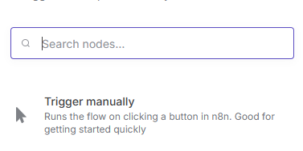
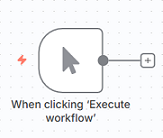
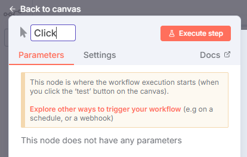

# ⚡ Nodo Trigger → Manually

El nodo **Trigger → Manually** se utiliza para **iniciar un workflow de forma manual**, sin depender de disparadores automáticos (como webhooks o cron jobs).  
Es ideal durante la **fase de pruebas o depuración**, ya que permite ejecutar el flujo paso a paso.

---

## 🧩 1️⃣ Buscar el nodo Trigger

- En el panel lateral de n8n, escribe **Trigger** en la barra de búsqueda.
- Selecciona la opción **Manually**.

---

## ⚙️ 2️⃣ Agregar el nodo Trigger manual

- Arrastra el nodo al lienzo del workflow o haz clic para insertarlo.
- Este nodo servirá como **punto de inicio** para ejecutar el flujo de forma controlada.

> 💡 **Consejo:**  
> El nodo _Manually_ solo se ejecuta dentro del editor de n8n.  
> En producción deberás reemplazarlo por un trigger real, como `Webhook`, `Cron`, `Gmail Trigger`, etc.

---

## 🏷️ 3️⃣ Renombrar el nodo

- Haz **doble clic** sobre el nodo.
- Cambia su nombre por uno descriptivo (por ejemplo: `Inicio Manual` o `Trigger de Prueba`).
- Esto te ayudará a identificarlo fácilmente dentro del flujo.

---

## ▶️ 4️⃣ Ejecutar el workflow

- Haz clic en **Execute Workflow** o en **Execute Node**.
- Si la ejecución es correcta, el nodo mostrará un **✅** indicando éxito.

> ⚠️ **Nota:**  
> Si el flujo no se ejecuta, asegúrate de que no existan errores en los nodos posteriores y que todos tengan configuraciones válidas.

---

## ✅ Resultado esperado

Con este nodo podrás:

- Probar workflows de forma manual sin depender de disparadores automáticos.
- Verificar la configuración y salida de cada nodo antes de automatizar el flujo.
- Depurar errores paso a paso directamente desde el editor de n8n.
