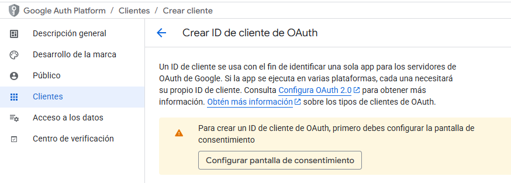
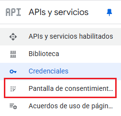
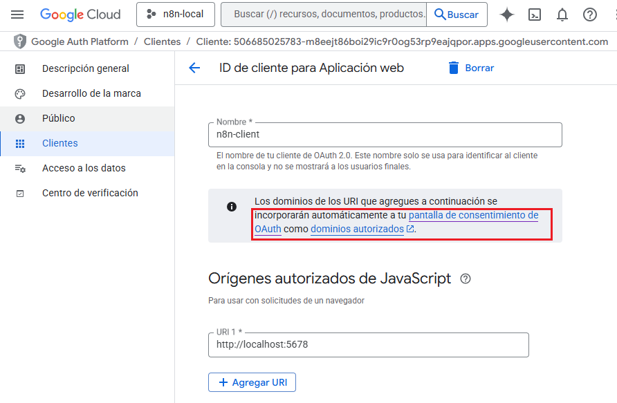
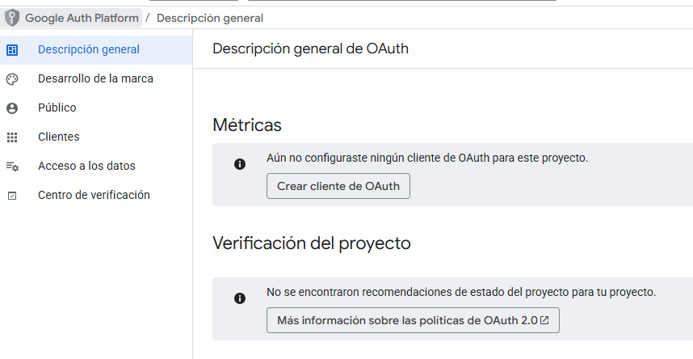
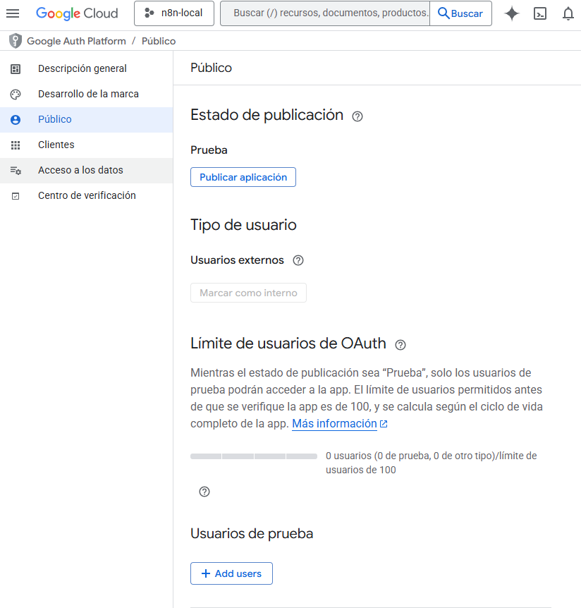
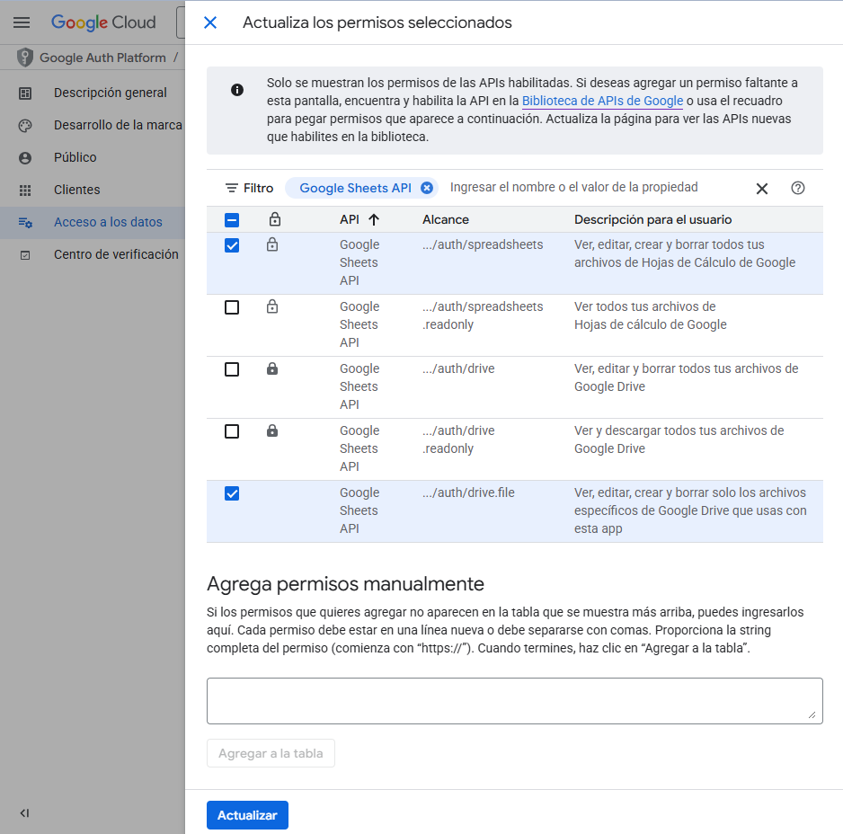
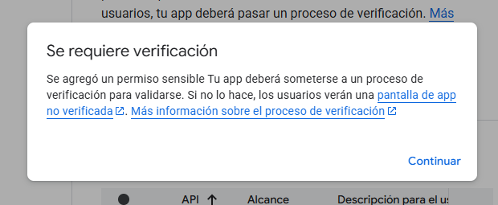
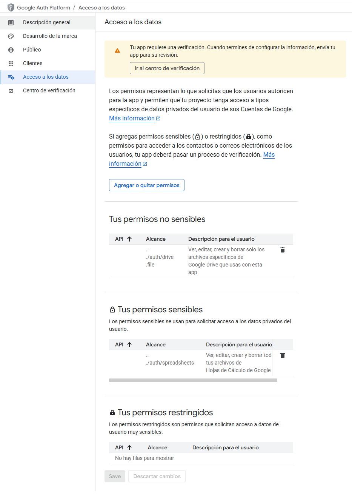

# ⚙️ Configurar Pantalla de Consentimiento (OAuth)

La **Pantalla de Consentimiento** de Google es obligatoria cuando se configura OAuth en una aplicación.  
Aquí se detallan los pasos para crearla o modificarla.

---

## 🔹 1. Acceso inicial

- Si **no se ha configurado la Pantalla de Consentimiento**, aparecerá la siguiente opción:  
  👉 Dar clic en **Configurar Pantalla de Consentimiento**

> 📌 **Nota**:  
> Si ya está configurada y se necesita modificar:
>
> - Se puede ingresar desde **APIs y Servicios**.  
>   
>
> - O desde **APIs y Servicios → Credenciales**, seleccionando el cliente OAuth creado.  
>   

---

## 🔹 2. Crear cliente de OAuth

Dar clic en **Crear Cliente OAuth**.

---

## 🔹 3. Seleccionar tipo de publicación

Debes elegir entre:

- **Público (Public)**
- **Interno (Audience)**

⚠️ **Nota importante**: Seleccionar “Público” en esta etapa puede generar problemas y requerir **revertir la publicación más adelante**.  
👉 Se recomienda consultar la necesidad de publicar antes de elegir esta opción.

---

## 🔹 4. Definir acceso a los datos

Selecciona **Acceso a los Datos (Data Access)**.

---

## 🔹 5. Configurar alcances (Scopes)

Define los **permisos** que la aplicación solicitará sobre el usuario:

- Dar clic en **Agregar o quitar permisos (Add or remove scopes)**.
- Seleccionar los permisos necesarios y guardar.

---

## 🔹 6. Verificación requerida

Algunos permisos requieren revisión adicional.

- Aparecerá el mensaje **“Se requiere verificación”**.
- Dar clic en **Continuar**.

---

## 🔹 7. Agregar comentarios y guardar

- Completa los comentarios solicitados.
- Guarda los cambios.
- El estado de la aplicación quedará como **“Se necesita verificación”**.

---

## 🔹 8. Revertir publicación

En caso de haber seleccionado **Público (Public)**, puedes regresar la aplicación a **modo de prueba**:  
👉 Dar clic en **Volver al modo de prueba**.

---

✅ Con estos pasos, la Pantalla de Consentimiento queda configurada correctamente y lista para vincular con tu aplicación.
