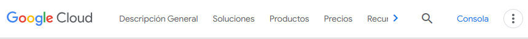
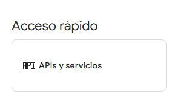
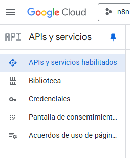
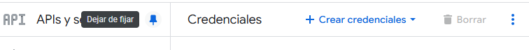
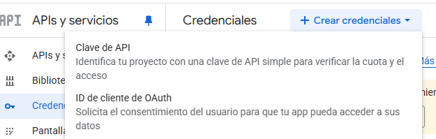
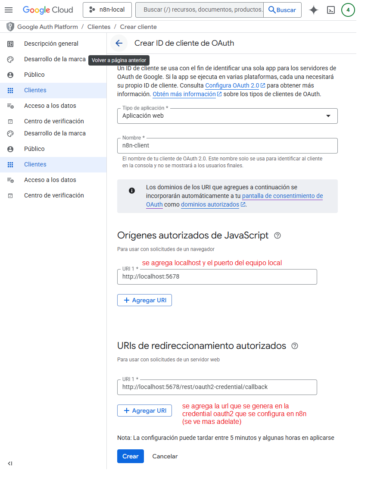
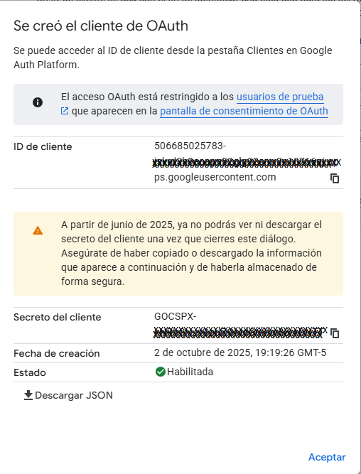

# 🔑 Crear credenciales (API Key / OAuth) en Google Cloud

Para que n8n pueda integrarse con servicios de Google (ej. Gmail, Google Sheets, Drive), es necesario **crear credenciales OAuth** en Google Cloud Console.

---

## 📑 Pasos detallados

### 1. Acceder a Google Cloud

Ir al sitio oficial 👉 [Google Cloud](https://cloud.google.com/)

---

### 2. Ingresar a la consola

- Haz clic en el botón **“Consola”**.
- O accede directamente: [Google Cloud Console](https://console.cloud.google.com/welcome?organizationId=0).

---

### 3. Crear o seleccionar un proyecto

- Puedes [crear un proyecto nuevo](../create-new-proyect/tool-create-new-proyect.md) (ejemplo: `n8n-local`).
- O usar un proyecto existente en tu organización.

---

### 4. Habilitar credenciales OAuth

1. Ir al menú **APIs y servicios →**

   

2. Seleccionar la opción **Credenciales**:

   

3. Clic en **Create Credentials**:

   

4. Elegir la opción **ID de cliente de OAuth**:

   

5. Configurar y guardar tu **cliente OAuth**:

   

---

### 5. Configurar la Pantalla de Consentimiento

Antes de usar las credenciales es obligatorio configurar la **Pantalla de Consentimiento**:  
👉 [Ver guía de configuración](../consent-screen/tool-consent-screen.md)

---

### 6. Copiar credenciales del cliente OAuth

Al finalizar, copia y guarda:

- **Client ID**
- **Client Secret**

Estas credenciales serán necesarias para conectar n8n con los servicios de Google.

---

## ✅ Resultado esperado

Al completar estos pasos tendrás un **ID de Cliente OAuth** y su **secreto asociado**, listos para integrarse en tu flujo de trabajo con n8n.
