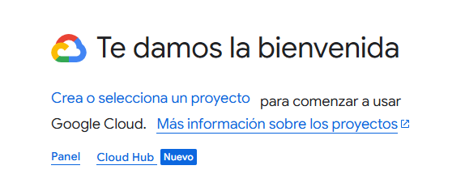
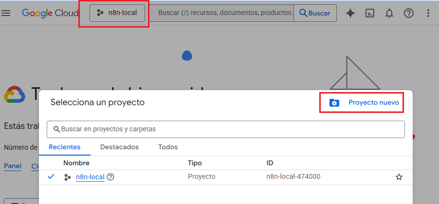
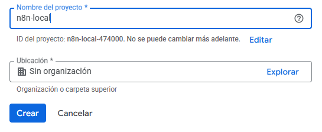

# 📂 Crear un nuevo proyecto en Google Cloud

En Google Cloud, cada integración o aplicación debe estar asociada a un **proyecto**.  
El proyecto centraliza las **APIs habilitadas, credenciales y configuración** que usará n8n.

---

## 🔹 1. Pantalla inicial sin proyectos

Si no existe ningún proyecto creado, se mostrará la siguiente pantalla:

---

## 🔹 2. Seleccionar o cambiar de proyecto

Si ya existe un proyecto, haz clic en el nombre del **proyecto actual** (barra superior).  
Esto te permitirá:

- Cambiar al proyecto existente donde quieras crear las credenciales.
- O bien, iniciar la creación de un nuevo proyecto.

---

## 🔹 3. Crear un nuevo proyecto

Para crear un proyecto nuevo:

1. Clic en **Nuevo Proyecto**.
2. Ingresa un nombre (ejemplo: `n8n-local`).
3. Selecciona la **organización** o **cuenta** asociada.
4. Presiona **Crear**.

---

## ✅ Resultado esperado

Al finalizar tendrás un **proyecto nuevo en Google Cloud**, que servirá como base para:

- Habilitar APIs de Google (Gmail, Sheets, Drive, etc.).
- Configurar credenciales OAuth.
- Gestionar la seguridad y accesos de tu integración con n8n.
