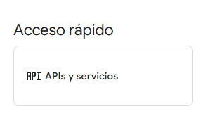
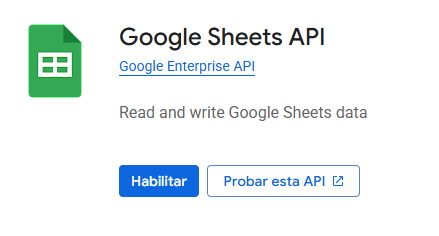
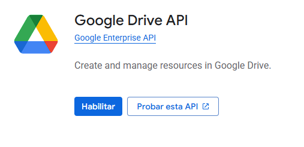

# ⚡ Habilitar servicios (APIs) para el cliente OAuth

Para que n8n pueda interactuar con Google (correos, hojas de cálculo y archivos), es necesario **habilitar las APIs correspondientes en tu proyecto de Google Cloud**.

---

## 🔹 1. Acceder a la librería de APIs

Ir a **API & Services → Library** desde la consola de Google Cloud:

---

## 🔹 2. Habilitar APIs necesarias

### 📊 Google Sheets API

- **Función**: permite a n8n leer, crear y actualizar hojas de cálculo de Google Sheets.
- **Casos de uso**:
  - Guardar correos recibidos en una hoja.
  - Generar reportes automáticos desde bases de datos.
  - Compartir datos de workflows con otros usuarios.

---

### ✉️ Gmail API

- **Función**: permite a n8n acceder al correo electrónico de Gmail.
- **Casos de uso**:
  - Leer correos entrantes y procesarlos automáticamente.
  - Enviar correos desde un workflow.
  - Crear alertas o notificaciones basadas en mensajes recibidos.

---

### 📂 Google Drive API

- **Función**: habilita la gestión de archivos almacenados en Google Drive.
- **Casos de uso**:
  - Acceder a archivos que contienen datos (ej. CSV o imágenes).
  - Guardar automáticamente documentos generados en un flujo.
  - **Requisito para Google Sheets**, ya que las hojas se almacenan dentro de Drive.

---
